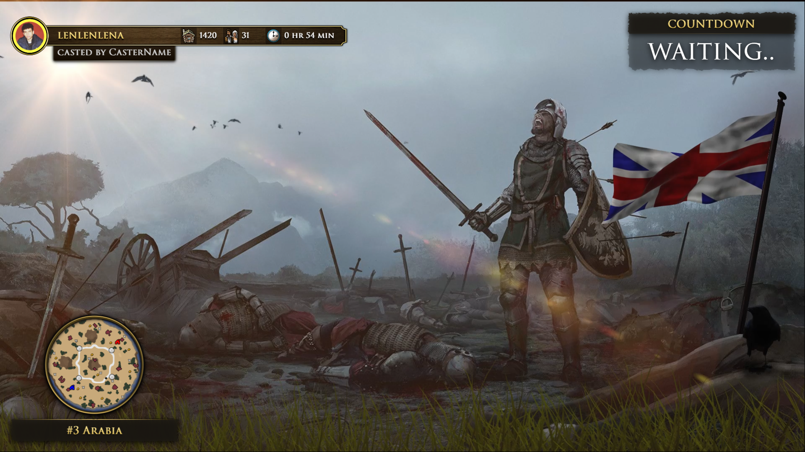

<!-- PROJECT LOGO -->
 

  

# Stream Overlay

*A tool to create a professional looking overlay with an animated video background for Age of Empires 3 streams*

**Developer:** VladTheJunior 
**Current version:** 0.2.4 

[Download Portable](https://github.com/VladTheJunior/StreamOverlay/releases/latest/download/StreamOverlay.zip) 
[Download Installer from Goolge Drive](https://drive.google.com/file/d/18mIdpSMDVwopK8VXqyIZq9NBL3D7V_7m/view?usp=sharing) 

*__Note:__ Portable version may require .NET6 desktop runtime: https://dotnet.microsoft.com/en-us/download/dotnet/6.0*
*__Another Note__: Versions below .NET 6.0.5 had a bug with displaying tooltips. Be sure that you are using an updated version of .NET if you find this bug.*
You can also join my Discord server to stay up to date with the latest updates and news about my current developments and projects: [Commando Squad](https://discord.gg/egcZRKgj4q)

### How to add overlay in OBS/Streamlabs OBS
Select settings as on image below

## Table of Contents

* [About the Project](#about-the-project)
* [Featurest](#features)
* [Hotkeys](#hotkeys)
* [Tips](#tips)
* [Screenshots](#screenshots)
* [License](#license)
* [Contact](#contact)
* [Acknowledgements](#acknowledgements)

<!-- ABOUT THE PROJECT -->
## About The Project

This project is aimed at improving the quality of streamers' content. Overlay can be set before the start of events such as tournaments or showmatches, or during breaks. The advantages of this tool over manual configuration in OBS Studio are ease of installation and high quality overlay in just a minute.
The original intent of the app was to make it easy to create an overlay for ESOC streamers, but now it's aimed at regular streamers as well.

You can also join my discord server to stay up to date with the latest updates and news about my current developments and projects: [Commando Squad](https://discord.gg/egcZRKgj4q)

## Features
* Animated video background.
* Countdown timer.
* Schedule textbox.
* Map pool ticker.
* Brand and event logos.
* Auto updater.
* Ability to move/show/hide elements in overlay window.

## Hotkeys
* **Ctrl+Up** : Adds 1 minute to countdown timer.
* **Ctrl+Down** : Subtracts 1 minute from countdown timer.
* **ESC** : Closes the overlay window and opens the settings window. Useful if you need to change some information or if the overlay is not used to reduce the load on the PC.
* **ALT+F4** : Completely closes the overlay application.
* **Ctrl+Space** : Minimize overlay window.
* **Ctrl+1** : Show/hide Countdown element.
* **Ctrl+2** : Show/hide Schedule element.
* **Ctrl+3** : Show/hide MapPool element.
* **Ctrl+4** : Show/hide BrandLogo element.
* **Ctrl+5** : Show/hide EventLogo element.

## Tips
* If there are overlay lags on the stream, you can turn off the animated background in the settings window.
* There is the possibility of creating automatic thumbnails for YouTube.
* You can add your own overlay, brand logo or event logo. All related data contains in **data** folder.
* If you find a bug or have any suggestions, please contact me in Discord: **VladTheJunior#1244**

## Screenshots

<!-- LICENSE -->
## License

Distributed under the MIT License. See `LICENSE` for more information.

<!-- CONTACT -->
## Contact

VladTheJunior - Discord: VladTheJunior#1244 - VladTheJunior@gmail.com

Project Link: [https://github.com/VladTheJunior/StreamOverlay](https://github.com/VladTheJunior/StreamOverlay)
